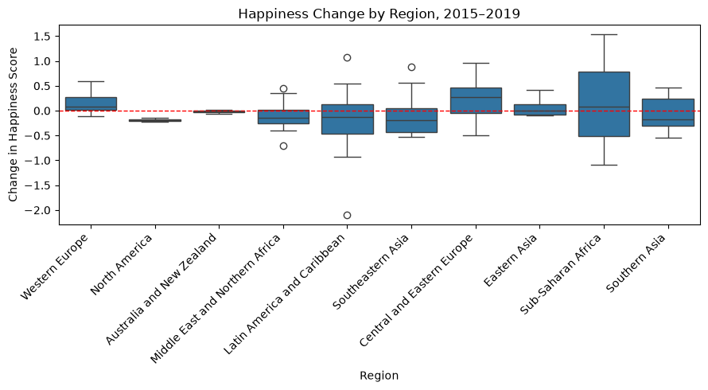
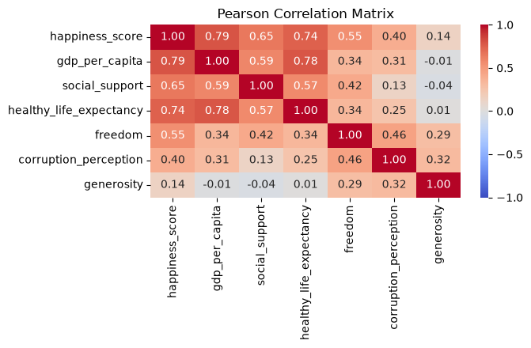

# Does the Shape of Happiness Matter?

**Factor balance and weakest-link effects in the World Happiness Report, 2015–2019**


Most analyses of the World Happiness Report ask which single factor (GDP, health, freedom…) goes with a higher happiness score. This project asks a different question: does the **configuration** of a country's six factors, how balanced the profile is and how strong its weakest dimension is, tell us anything about how its happiness **changes** afterwards?

Group project for the course *Research Methods for Business Analytics*. The full analysis is in [project.ipynb](project.ipynb).

## Research question

> Are changes in national happiness between the 2015 and 2019 reports associated with the configuration of a country's happiness-contribution factors in 2015, specifically its balance and its weakest factor?

| | Hypothesis | Method |
|---|---|---|
| **H1 – Factor balance** | Countries with more balanced 2015 profiles see more favourable happiness changes | Pearson and Spearman correlation, Welch t-test as robustness check |
| **H2 – Weakest link** | A stronger weakest factor in 2015 goes with more favourable changes, even after controlling for the overall factor level | Multiple linear regression (four nested models, HC3 robust standard errors) |

## Key findings

Based on a matched sample of **152 countries** present in both the 2015 and 2019 editions.

| | Result | Verdict |
|---|---|---|
| **H1** | Pearson r = −0.037 (p = 0.655), Spearman ρ = −0.024 (p = 0.768), Welch t-test p = 0.798 | Not supported: balance shows no relationship with later change |
| **H2** | β = 0.216, HC3 p = 0.049, 95% CI [0.001, 0.431] | Weakly supported: significant at 5% in the primary model, but not once Venezuela is removed (p = 0.090) |
| **Starting level** | β = −0.336, p < 0.001; adding it lifts R² from 0.026 to 0.203 | The strongest predictor of change by far |

In short: the shape of a country's factor profile explains little. **Where a country starts matters much more than how its profile is configured.** Countries that were less happy in 2015 caught up, happier ones changed less or declined (regression to the mean), and the weakest-link effect only becomes visible once this is accounted for.

<p align="center">
  
</p>

## Approach

1. **Data cleaning** – harmonised column names across five differently structured files, standardised country names, filled in missing regions, and checked missing values, duplicates and outliers. A per-country consistency check uncovered a data entry error in the source file: the United Kingdom and Israel rows are swapped in the 2018 edition, which we corrected.
2. **Exploratory analysis** – descriptive statistics, distributions, correlations, regional patterns and changes across report editions.
3. **Constructed variables** – the six factors are z-standardised within the 2015 report, then summarised per country:
   - `factor_balance`: standard deviation of the six standardised factors (lower = more balanced)
   - `weakest_factor`: minimum of the six standardised factors
   - `overall_factor_level`: mean of the six standardised factors
4. **Hypothesis testing** – correlation analysis for H1; incremental OLS models for H2, with checks for linearity, homoscedasticity (Breusch–Pagan), normality of residuals, multicollinearity (VIF), independence (Durbin–Watson) and influential observations (Cook's distance).

<p align="center">
  
</p>

## Data

[World Happiness Report](https://www.kaggle.com/datasets/unsdsn/world-happiness) on Kaggle, published by the Sustainable Development Solutions Network. Five CSV files, one per report edition (2015–2019), 782 country-edition observations covering 164 countries.

Two things to keep in mind when reading the results:

- The six factor variables are **model-derived contributions** to the happiness score, not raw measurements of GDP, life expectancy and so on.
- Each report edition is based on **multi-year survey averages**, so editions are not independent annual observations.

## Repository structure

```
├── project.ipynb     # full analysis: cleaning, EDA, hypotheses, methods, conclusions
├── data/             # World Happiness Report CSVs, 2015–2019
├── assets/           # figures used in this README
└── README.md
```

## Run it yourself

Requires Python 3.12.

```bash
git clone https://github.com/GiacomoAle8/ResearchMethodsProject.git
cd ResearchMethodsProject

python -m venv .venv
source .venv/bin/activate        # Windows: .venv\Scripts\activate

pip install pandas numpy scipy statsmodels matplotlib seaborn plotly jupyter
jupyter notebook project.ipynb
```

The two world maps are interactive Plotly figures. GitHub's notebook preview does not display them, so run the notebook locally to see them.

## Limitations

- The predictors are strongly correlated with each other (VIF between 3.3 and 7.1), which inflates standard errors.
- The H2 result depends on a single influential country, Venezuela, and should be read as suggestive.
- The balance and weakest-factor measures depend on the chosen z-score operationalisation; other definitions could give different results.
- Country-level observational data cannot establish causality, and the findings do not necessarily apply to individuals.

## Authors

Group TXA-A17

- Fabio Barbagallo
- Fabrice Keraudren
- Giacomo Aleotti

## Reference

Sustainable Development Solutions Network. (n.d.). *World Happiness Report* [Data set]. Kaggle. https://www.kaggle.com/datasets/unsdsn/world-happiness
